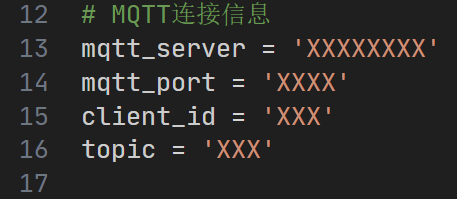

  

# 
STM32F103-Robot

  
  
  
  
  
  
  

🎉一个基于STM32F103C8T6的四足爬行机器人🎉

🚫项目仅供学习交流🚫

## 一、项目介绍

&emsp;&emsp;本设计使用STM32F103C8T6作为主控，结合ESP32-CAM与MQTT，实现实时图像回传以及远程控制。

  

实物图

&emsp;&emsp;在机器人的控制上使用了云端控制和本地控制两种方案。其中由Flet编写的移动端App能够通过MQTT协议与安装在服务器的EMQX进行通信，经云端传输的命令由ESP32-CAM接收后通过USART2传递给单片机，单片机就可以根据该命令控制模块，让机器人做出对应的动作。而ESP32-CAM拍摄的视频流则会实时上传至服务器，由服务器上部署的Nodejs Server接收后，通过网页呈现出来，至此实现了云端控制的全过程。

&emsp;&emsp;而本地控制则由Microdot来实现，在连接上由ESP32-CAM发出的热点之后，通过访问指定IP来访问本地控制面板。点击网页上的按钮就能够控制ESP32-CAM， ESP32-CAM通过串口向单片机发送命令。而由ESP32-CAM回传的图像流则会通过WIFI，实时显示在本地控制面板的上方。

  

系统结构图

&emsp;&emsp;仓库内包含了本项目所需的所有代码，其中还包括机器人的3D建模文件：

  <table>
    <thead>
      <tr>
        <th style="text-align: left;">文件名</th>
        <th style="text-align: left;">说明</th>
      </tr>
    </thead>
    <tbody>
      <tr>
        <td style="text-align: left;">1、FreeCAD_Projects</td>
        <td style="text-align: left;">机器人3D建模工程文件</td>
      </tr>
      <tr>
        <td style="text-align: left;">2、HAL_C8T6</td>
        <td style="text-align: left;">开发STM32的工程文件</td>
      </tr>
      <tr>
        <td style="text-align: left;">3、Fletapp</td>
        <td style="text-align: left;">开发Flet应用的工程文件</td>
      </tr>
      <tr>
        <td style="text-align: left;">4、ESP32-CAM</td>
        <td style="text-align: left;">开发ESP32-CAM的Python代码以及前端代码</td>
      </tr>
      <tr>
        <td style="text-align: left;">5、CAM_Server</td>
        <td style="text-align: left;">服务器上负责ESP32-CAM图像接收的Nodejs代码</td>
      </tr>
      <tr>
        <td style="text-align: left;">6、Other</td>
        <td style="text-align: left;">包含Gerber文件和BOM表等文件</td>
      </tr>
    </tbody>
  </table>

## 二、项目设计过程

### 2.1 结构设计
&emsp;&emsp;四足爬行机器人的结构设计则使用了开源软件FreeCAD进行设计。结合MG90S舵机的尺寸，在腿部设计了凹槽与螺丝安装孔。机体中间预留电池安装孔，在关键位置还设计了螺丝孔，使结构更加牢固，方便后期的安装。

  

3D模型图

&emsp;&emsp;建模完成后使用切片软件对模型进行切片，并将切片结果导入至3D打印机当中进行打印。填充密度为0.1mm，层厚0.2mm，挤出头温度设定为210℃。打印材料则选择了直径为1.75mm的PLA材料。电源板上预留了螺丝孔以安装尼龙柱，各个功能模块由万用板电路连接后通过尼龙柱堆叠在机体上方，方便快速装卸和调试。

### 2.2 电源设计

&emsp;&emsp;四足爬行机器人的电源模块选用了TI的TPS5430，在设计参考了[【电赛模块】TPS5430正负电源输出模块](https://oshwhub.com/quan-guo-dian-sai/dian-sai-mo-kuai-tps5430-fu-dian-yuan-shu-chu-mo-kuai)。电源模块上分别设计了三路电源，分别为舵机以及主控与功能模块进行供电。

  

原理图

  

电源板3D渲染图

### 2.3 STM32F103C8T6的开发

&emsp;&emsp;在机器人上电后，首先初始化功能模块以及相关外设，同时初始化FreeRTOS，之后的任务就转交给FreeRTOS进行调度。在收到来自USART2的命令之前，单片机执行默认任务。在默认任务里，机器人始终保持停止状态，等待用户发送的命令。在USART2接收到命令后，单片机会进入串口中断程序，并在中断程序内判断该指令的具体含义，通过指令内容来执行对应的任务。

  

程序流程图

&emsp;&emsp;当USART2收到来自ESP32-CAM发送的信息时，单片机会执行USART2的中断函数，在中断函数内，对接收到的信息进行判断。首先在代码中创建一个数组以设置缓冲区，结合HAL库函数将接收到的数据存在缓冲区当中，之后匹配缓冲区内的内容来判断是否是对应的命令。

&emsp;&emsp;在代码中先判断当前机器人所执行的任务是否是当前已经被激活的任务，如果是则直接跳过，避免了任务被重复激活而导致单片机死机。在判断任务没有被重复激活之后，通过事件位来触发机器人的动作任务。在动作任务被触发后，根据任务标志执行对应的任务内容。

&emsp;&emsp;匹配到对应的任务内容后，开始执行对应的代码。先在OLED上显示当前的任务状态，之后执行对应的动作函数，至此完成了任务流程。任务在被激活后会反复执行，直到被新的指令打断。

&emsp;&emsp;⚠注意：项目中还包括了STM32对OLED12864、HC-SR04超声波模块、PCA9685舵机驱动模块的驱动实现。关于驱动原理可以根据项目代码可看出，这里不再过多赘述，可自行下载项目代码查看。

### 2.4 ESP32-CAM开发

&emsp;&emsp;ESP32-CAM在烧录[MicoroPython固件](https://github.com/shariltumin/esp32-cam-micropython-2022)后使用[Arduino Lab for MicroPython](https://github.com/arduino/lab-micropython-editor)开发，相关的MicroPython固件也可在本仓库中获取。

&emsp;&emsp;[Microdot](https://github.com/miguelgrinberg/microdot)是一个极小的Python Web框架，专为资源受限的系统设计，例如微控制器以及嵌入式系统，适合运行在MicroPython之上。在本文的设计中，利用Microdot与ESP32-CAM支持WIFI的特性，在ESP32-CAM上搭建一个小型的Web服务器，实现用户与机器人之间的交互。

  

ESP32-CAM程序流程图

&emsp;&emsp;ESP32-CAM在上电之后，会自行执行内部的程序。程序会在一开始初始化摄像头设备，并启动AP热点以等待用户连接。待用户连接到由ESP32-CAM发出的AP热点后，在浏览器中访问192.168.4.1，即可进入模式选择网页。这里的前端网页也是以文件的形式保存在ESP32-CAM当中的，因此整个连接过程完全在本地执行。

  

“模式选择”界面

&emsp;&emsp;以本地控制为例，用户选择“本地控制”后，向ESP32-CAM发送Get请求。ESP32-CAM在接收到指令后，返回本地控制面板的网页。在本地控制网页当中就可以直接看到由ESP32-CAM拍摄的图像流画面。画面下方则为机器人的控制按钮，即前进、后退、左转、右转。当用户按下按钮后，按钮中间会出现信息提示，告诉用户当前按钮按下的功能以及按钮的状态。

  

“本地控制面板”界面

&emsp;&emsp;在用户按下按钮后，同样会以Get请求的形式向ESP32-CAM发送命令，ESP32-CAM在接收到指令后，直接在串口输出命令，同时串口连接在STM32的USART2上。至此实现了用户对机器人的控制。

&emsp;&emsp;若用户选择的是AP配网，同样是以get请求的方式向ESP32-CAM发送数据，ESP32-CAM则向用户返回配网页面。在配网页面内，用户则需要输入WIFI名称和密码。由于ESP32-CAM只支持2.4G，因此用户在连接时需要注意连接的WIFI频段是否是2.4GHz的。

  

“WIFI设置”界面

&emsp;&emsp;在用户提交信息之后，跳转至确认界面，这一设计为用户提供了一个修改的机会，如果之前填写的信息有误，用户可返回修改，若信息确认无误，则点击确认按钮提交至ESP32-CAM。

  

“提交成功”界面

&emsp;&emsp;在ESP32-CAM接收到来自用户侧发送的WIFI信息后，则执行连接WIFI热点的代码，在连接WIFI的同时断开与用户的连接，同时连接至在代码中已经设置好的MQTT服务器，至此完成本地AP配网以及云端连接的流程。

&emsp;&emsp;在机器人上电后，首先初始化功能模块以及相关外设，同时初始化FreeRTOS，之后的任务就转交给FreeRTOS进行调度。在收到来自USART2的命令之前，单片机执行默认任务。在默认任务里，机器人始终保持停止状态，等待用户发送的命令。在USART2接收到命令后，单片机会进入串口中断程序，并在中断程序内判断该指令的具体含义，通过指令内容来执行对应的任务。

### 2.5 Flet应用开发

&emsp;&emsp;[Flet](https://github.com/flet-dev/flet)是一种基于Python的应用框架，允许开发者使用Python语言构建Web、桌面以及移动端应用程序，其灵感源于Google的Flutter。Flet的设计非常轻量，并且支持多种平台，具有一套代码多端使用的跨平台特性。基于Python语言构建使得应用程序更容易维护，同时社区提供了丰富的控件，可以轻松构建用户界面。

  

Flet应用界面

&emsp;&emsp;App主要分为“说明”页面与“控制”页面两个部分。“说明”页面的作用是向用户简要介绍App的使用方法，包括机器人的控制方法以及配网流程。“控制”页面则为用户提供控制界面，同时将云端获取到的视频流在界面中显示。

&emsp;&emsp;当用户选择“控制”按钮后，App会按照程序中的设置，连接到设置好的IP地址、端口以及订阅的Topic，连接至EMQX服务器。页面中的视频则以WebView控件的形式，将网页上的图像流显示在页面当中。

&emsp;&emsp;当用户按下按钮后，App则通过网络，向EMQX平台发送命令，由于ESP32-CAM和App都连接到了服务器并且订阅了相同的Topic，因此在App发送信息的同时，ESP32-CAM也能从云服务器收到消息。在ESP32-CAM收到命令后，则通过串口，将命令转发至STM32，触发串口中断并执行对应的任务。至此完成由用户端经云服务到机器人的控制流程。

## 三、机器人步态规划

&emsp;&emsp;机器人行进动作可拆分为三个状态，这里以前进动作为例：

+ 动作①：机器人将左右前肢与身体平行，后肢与身体呈135°夹角，四只脚垂直于地面，为接下来迈步做准备。
+ 动作②：机器人的左前脚与右后脚同时抬高45°，之后左前肢与右后肢同时向前45°，最后左前脚与右后脚同时落下。
+ 动作③：机器人的左后脚与右前脚同时抬高45°，之后左后肢与右前肢同时向前迈出45°，左前肢与右后肢同时向后45°最后左后脚与右前脚同时落下。

&emsp;&emsp;通过不断重复动作组，机器人能够实现四肢往返交替前进，而后退动作则是前进动作的镜像。

  

前进、后退步态示意图

&emsp;&emsp;机器人的转体动作同样可分为三个部分，以左转动作为例：

+ 动作①：机器人将左右前肢与身体平行，后肢与身体呈135°夹角，四只脚垂直于地面，为接下来迈步做准备。
+ 动作②：左后脚与右前脚向上抬起45°，之后左后肢与右前肢先向逆时针移动45°后左后脚与右前脚落下。左前脚与右后脚抬起45°，右后肢逆时针移动45°后左前脚和右后脚落下。
+ 动作③：机器人将左后肢、右前肢和右后肢同时顺时针转45°，完成一次转体动作。

&emsp;&emsp;右转动作与左转相同，仅需将关节的旋转角度修改为逆时针即可。

  

左转、右转步态示意图

## 四、项目搭建及部署

### 4.1 MQTT服务器的部署以及服务器图像接收的配置

&emsp;&emsp;本项目使用EMQX作为MQTT服务器，其功能非常强大，可参考[EMQX官网](https://www.emqx.com/)进行部署。依托阿里云的轻量应用服务器，利用1panel linux运维面板快速安装应用。在1panel面板中找到应用市场，搜索EMQX并点击安装。服务器就会自动给执行命令，从Docker镜像仓库拉取镜像并自动部署。之后在阿里云的服务器管理界面开放对应的端口，可自行选择使用域名解析后访问。待安装完成后，直接在浏览器中访问域名即可进入EMQX的控制面板。

  

EMQX面板

&emsp;&emsp;同样是使用1panel linux运维面板，先将本仓库当中“CAM_Server”文件夹中的代码上传至服务器的文件目录当中。在运维面板的菜单中找到网站->运行环境，选择“node.js”,之后点击“创建运行环境”。

  

创建运行环境

&emsp;&emsp;记得到云服务器/运维面板的防火墙开启对应的端口哦！😊

### 4.2 STM32开发环境

&emsp;&emsp;STM32使用HAL库进行开发，用STMCubeMX建立基础工程，与CLion配合开发。关于环境的搭建教程网上已经有很多教程指导了，这里就不再赘述。clone本仓库代码后，直接使用Clion打开“HAL_C8T6”文件夹即可使用。

### 4.3 ESP32-CAM开发环境

&emsp;&emsp;下载完前文提到的Arduino Lab for MicroPython IDE之后，打开IDE并将ESP32-CAM连接电脑。在IDE内连接对应的串口，将本仓库代码中“ESP32-CAM”文件夹内的文件烧录到ESP-CAM当中。

&emsp;&emsp;在“main.py”当中，如下地方需要自行修改为自己的服务器信息：

  

接收图像的服务器信息

  

MQTT服务器信息

### 4.4 Flet应用开发环境

&emsp;&emsp;Flet应用由于使用Python语言，所以使用PyCharm IDE进行开发。Flet具体的环境搭建可以参考[Flet官方文档](https://flet.dev/docs/getting-started)。同样的，在clone本仓库的代码后，直接使用PyCharm IDE打开项目中的“Fletapp”文件夹即可使用。

&emsp;&emsp;在“mqtt.py”当中，如下地方需要自行修改为自己的服务器信息：

  

MQTT服务器信息

&emsp;&emsp;在应用的开发过程中，由于编译出的APK文件一直不能够正常工作，因此就就尝试使用了Dev分支的SDK版本，以下是版本信息：

  

Flet应用版本信息

### 4.5 模块接线图

&emsp;&emsp;在搞定软件后，将各个模块与STM32连接，以下是模块连接图：

  

模块连接图

&emsp;&emsp;至此，应该能够将这个小机器人造出来啦~😎

## 五、项目总结

+ 电源模块的设计仍然存在缺陷：虽然电源模块能够正常工作且输出电压，但是在设计过程当中仅仅考虑到了功能性，没有充分考虑到安全性。PCB电路的裸露容易导致线路因误触发生短路，会对电源模块乃至整个系统都造成安全威胁。可以考虑添加保险丝，可防止电源短路时产生的大电流导致的电路烧毁。同时还需要添加防反接/防倒灌二极管，以此来避免电源芯片的烧毁。
+ 舵机的选取以及机器人的结构与姿态问题：由于在设计之初没有考虑到电池的重量，导致在实际运行时MG90S无法轻松支撑起机器人的重量。在行进过程中，由于机器人的重心不稳定导致前进与后退的任务都不是按照正常的直线轨迹行进。也有可能是因为3D打印机的误差较大，导致实际打印出来的结构体都存在一定偏移，最终导致了机器人的重心不稳与受力不均。
+ App的优化：虽然App能够实现基础功能，但是仍然存在一系列的问题，例如App在使用完成后，必须清除缓存数据才能再次使用，否则打开之后屏幕会一直处于白屏状态，无法正常使用。同时App的控制界面没有实现自适应设备，一旦使用平板打开就会导致画面留有大量留白。在按下按钮后，按钮上方的画面也会随着页面同步刷新，影响使用。

👇项目演示👇

https://github.com/user-attachments/assets/f1a0bd48-f576-4248-8a84-5862ebdc9574

## 六、参考资料

+ [flet-dev/flet](https://github.com/flet-dev/flet)
+ [Alidong/PCA9685_STM32HAL](https://github.com/Alidong/PCA9685_STM32HAL)
+ [mokhwasomssi/stm32_hal_ssd1306](https://github.com/mokhwasomssi/stm32_hal_ssd1306)
+ [shariltumin/esp32-cam-micropython-2022](https://github.com/shariltumin/esp32-cam-micropython-2022)
+ [STM32入门教程-2023版 细致讲解 中文字幕](https://www.bilibili.com/video/BV1th411z7sn/?p=32)
+ [韦东山freeRTOS系列教程之【第八章】事件组(event group)](https://blog.csdn.net/thisway_diy/article/details/121532692)
+ [STM32系列(HAL库)——F103C8T6通过HC-SR04超声波模块实现测距](https://blog.csdn.net/lwb450921/article/details/123670786)

&emsp;&emsp;还有我以前的项目：

+ [jmzdd/Simple-Quadruped-Robot_Code](https://github.com/jmzdd/Simple-Quadruped-Robot_Code)
+ [jmzdd/Simple-Quadruped-Robot_Models](https://github.com/jmzdd/Simple-Quadruped-Robot_Models)
